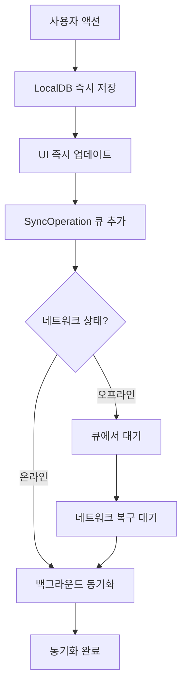

# 📱 SimplyToDo 오프라인 동기화 시스템 PRD v2.0

## 📋 문서 정보
- **제품명**: SimplyToDo
- **기능명**: 오프라인 동기화 시스템 (Offline-First Architecture)
- **버전**: v2.0 (상세 구현 가이드)
- **작성일**: 2025-01-27
- **작성자**: Development Team
- **관련 문서**: Task.md Section 5, 기존 5-1-offline-sync.md v1.0

## 🎯 개요 (Overview)

### 핵심 목표 (Core Objectives)
사용자가 네트워크 연결 상태와 관계없이 SimplyToDo의 모든 핵심 기능을 원활하게 사용할 수 있도록 하고, 온라인 복귀 시 완벽한 데이터 동기화를 제공하는 **오프라인 우선 아키텍처(Offline-First)**를 구현합니다.

### 핵심 가치 제안
- **🚀 즉시 반응**: 모든 사용자 액션이 네트워크 대기 없이 즉시 처리
- **🔒 데이터 안전**: 오프라인 상태에서도 데이터 손실 없이 완전 보호
- **🔄 스마트 동기화**: 지능적 충돌 해결과 자동 백그라운드 동기화
- **📱 원활한 UX**: 네트워크 상태가 사용자 경험을 방해하지 않음

### 비즈니스 배경
- **모바일 우선 환경**: 지하철, 엘리베이터, 터널 등 네트워크 단절 빈번
- **생산성 도구 특성**: 할 일 관리는 언제 어디서나 즉시 사용되어야 함
- **사용자 신뢰**: 데이터 손실은 생산성 앱의 치명적 약점
- **경쟁 우위**: 대부분의 경쟁 앱이 온라인 의존적

### 성공 지표 (Success Metrics)
#### 기능적 지표
- **오프라인 기능 완성도**: 핵심 기능 100% 오프라인 지원
- **데이터 동기화 성공률**: 99.9% 이상
- **충돌 해결 정확도**: 95% 이상 자동 해결

#### 성능 지표  
- **앱 응답성**: 오프라인에서도 100ms 이내 UI 반응
- **동기화 속도**: 100개 항목 기준 3초 이내
- **배터리 영향**: 기존 대비 10% 이내 증가

#### 사용자 경험 지표
- **오프라인 사용 만족도**: 4.5/5 이상
- **동기화 투명성**: 사용자가 동기화 상태를 명확히 인지
- **데이터 손실률**: 0% (완전한 데이터 보호)

## 🎯 핵심 기능 요구사항

### 1. 오프라인 데이터 저장 시스템

#### 1.1 로컬 데이터베이스 구조
```typescript
// SQLite 기반 로컬 데이터베이스
interface LocalDB {
  todos: LocalTodo[];
  categories: LocalCategory[];
  recurring_rules: LocalRecurringRule[];
  sync_operations: SyncOperation[];
  sync_status: SyncStatusRecord[];
}

interface LocalTodo {
  id: string;
  text: string;
  completed: boolean;
  importance: number;
  due_date: string | null;
  category_id: string | null;
  parent_id: string | null;
  grade: number;
  user_id: string;
  created_at: string;
  updated_at: string;
  local_timestamp: number;
  sync_status: 'synced' | 'pending' | 'failed';
}
```

#### 1.2 동기화 큐 관리
```typescript
interface SyncOperation {
  id: string;
  entity_type: 'todo' | 'category' | 'recurring_rule';
  entity_id: string;
  operation: 'create' | 'update' | 'delete';
  data: any;
  local_timestamp: number;
  retry_count: number;
  status: 'pending' | 'syncing' | 'synced' | 'failed' | 'conflict';
  error_message?: string;
}
```

### 2. 네트워크 상태 관리

#### 2.1 실시간 네트워크 감지
- **@react-native-netinfo** 활용한 연결 상태 모니터링
- **연결 품질 테스트**: 실제 서버 ping으로 네트워크 품질 확인
- **상태 변화 이벤트**: 온라인/오프라인 전환 시 자동 동기화 트리거

#### 2.2 네트워크 상태 UI
```typescript
interface NetworkStatus {
  isOnline: boolean;
  connectionType: 'wifi' | 'cellular' | 'none';
  syncStatus: 'synced' | 'syncing' | 'pending' | 'failed' | 'conflict';
  pendingOperations: number;
  lastSyncTime: Date | null;
}
```

### 3. 로컬 우선 아키텍처 (Local-First)

#### 3.1 데이터 처리 우선순위
1. **사용자 액션 → 로컬 즉시 처리** (< 100ms)
2. **UI 즉시 업데이트** (낙관적 업데이트)
3. **동기화 큐에 작업 추가**
4. **백그라운드 동기화 수행**

#### 3.2 오프라인 지원 기능 매트릭스
| 기능 | 오프라인 지원 | 비고 |
|------|--------------|------|
| Todo CRUD | ✅ 완전 지원 | 모든 생성/수정/삭제/완료 |
| Subtask 관리 | ✅ 완전 지원 | 3단계 계층 구조 |
| Category 관리 | ✅ 완전 지원 | 생성/수정/삭제 |
| 반복 작업 | ✅ 로컬 생성 | 인스턴스 로컬 생성 |
| 통계 계산 | ✅ 실시간 | 로컬 데이터 기반 |
| AI 서브태스크 | ❌ 온라인 필요 | 외부 API 의존 |
| 소셜 로그인 | ❌ 온라인 필요 | 인증 서버 필요 |

### 4. 동기화 전략

#### 4.1 양방향 동기화 구조
```typescript
interface SyncStrategy {
  upload: {
    queue: SyncOperation[];
    batchSize: number;
    retryPolicy: ExponentialBackoff;
  };
  download: {
    lastSyncTimestamp: number;
    incrementalSync: boolean;
    conflictResolution: ConflictStrategy;
  };
}
```

#### 4.2 충돌 해결 전략
```typescript
type ConflictStrategy = 
  | 'last_write_wins'      // 최근 수정 우선 (기본)
  | 'user_choice'          // 사용자 선택
  | 'smart_merge'          // 필드별 지능적 병합
  | 'server_wins'          // 서버 데이터 우선
  | 'local_wins';          // 로컬 데이터 우선

interface ConflictResolution {
  conflictId: string;
  entityType: string;
  entityId: string;
  localData: any;
  serverData: any;
  strategy: ConflictStrategy;
  userChoice?: 'local' | 'server' | 'merge';
  resolvedAt: Date;
}
```

### 5. 사용자 경험 설계

#### 5.1 상태 표시 시스템
```typescript
interface SyncStatusUI {
  networkIndicator: {
    icon: '📶' | '📴' | '🔄' | '⚠️';
    color: 'green' | 'orange' | 'red' | 'blue';
    text: string;
  };
  syncProgress: {
    visible: boolean;
    progress: number; // 0-100
    message: string;
  };
  conflictBadge: {
    count: number;
    urgent: boolean;
  };
}
```

#### 5.2 알림 및 피드백
- **동기화 완료**: "✅ 모든 변경사항이 동기화되었습니다"
- **오프라인 모드**: "📴 오프라인 모드 - 변경사항은 자동 저장됩니다"
- **동기화 실패**: "⚠️ 일부 데이터 동기화에 실패했습니다"
- **충돌 발생**: "🔄 데이터 충돌이 발견되었습니다. 해결이 필요합니다"

## 🎨 UI/UX 디자인 (User Interface Design)

### 1. 상태 표시
- 상단 배지: "오프라인", "동기화 중", "충돌 발생" 등
- 동기화 실패/충돌 시 토스트/모달 안내
- 충돌 내역 비교/선택 화면

### 2. 주요 플로우 예시
```
[오프라인] → 할 일 추가/수정/삭제 → [네트워크 복구] → 동기화 진행 → [충돌 발생] → 사용자 선택/병합 → 동기화 완료
```

### 3. 설정 화면
- 동기화 정책(자동/수동/주기) 선택
- 동기화 로그/상태 확인
- 로컬 데이터 초기화/복원 버튼

## 🛠 기술 구현 아키텍처

### 1. 핵심 서비스 구조

#### 1.1 OfflineManager (메인 오케스트레이터)
```typescript
class OfflineManager {
  private localDB: LocalDBService;
  private syncEngine: SyncEngine;
  private networkMonitor: NetworkMonitor;
  private conflictResolver: ConflictResolver;
  
  async initialize(): Promise<void>;
  async executeOperation(operation: DataOperation): Promise<void>;
  async syncWithServer(): Promise<SyncResult>;
  getNetworkStatus(): NetworkStatus;
}
```

#### 1.2 LocalDBService (SQLite 관리)
```typescript
class LocalDBService {
  async createTodo(todo: LocalTodo): Promise<string>;
  async updateTodo(id: string, updates: Partial<LocalTodo>): Promise<void>;
  async deleteTodo(id: string): Promise<void>;
  async getTodos(filters?: TodoFilters): Promise<LocalTodo[]>;
  
  async addSyncOperation(operation: SyncOperation): Promise<void>;
  async getPendingSyncOperations(): Promise<SyncOperation[]>;
  async markOperationSynced(operationId: string): Promise<void>;
}
```

#### 1.3 SyncEngine (동기화 엔진)
```typescript
class SyncEngine {
  async uploadPendingChanges(): Promise<UploadResult>;
  async downloadServerChanges(): Promise<DownloadResult>;
  async resolveConflicts(conflicts: ConflictData[]): Promise<void>;
  
  private async batchUpload(operations: SyncOperation[]): Promise<void>;
  private async incrementalDownload(since: Date): Promise<ServerData>;
  private async detectConflicts(local: any, server: any): Promise<ConflictData[]>;
}
```

#### 1.4 NetworkMonitor (네트워크 감지)
```typescript
class NetworkMonitor {
  isOnline(): boolean;
  getConnectionType(): ConnectionType;
  onNetworkChange(callback: (status: NetworkStatus) => void): void;
  
  async testServerConnectivity(): Promise<boolean>;
  startMonitoring(): void;
  stopMonitoring(): void;
}
```

### 2. 데이터 흐름 아키텍처

#### 2.1 사용자 액션 처리 흐름


#### 2.2 동기화 플로우
```typescript
interface SyncFlow {
  phase1_upload: {
    step1: 'get_pending_operations';
    step2: 'batch_upload_to_server';
    step3: 'mark_operations_synced';
  };
  phase2_download: {
    step1: 'get_last_sync_timestamp';
    step2: 'download_server_changes';
    step3: 'detect_conflicts';
    step4: 'merge_or_resolve_conflicts';
  };
  phase3_verification: {
    step1: 'verify_data_integrity';
    step2: 'update_sync_status';
    step3: 'notify_user_if_needed';
  };
}
```

### 3. 충돌 해결 시스템

#### 3.1 ConflictResolver 구조
```typescript
class ConflictResolver {
  async detectConflict(local: EntityData, server: EntityData): Promise<ConflictType>;
  async resolveConflict(conflict: ConflictData, strategy: ConflictStrategy): Promise<ResolvedData>;
  
  private smartMerge(local: any, server: any): Promise<MergedData>;
  private showUserChoiceDialog(conflict: ConflictData): Promise<UserChoice>;
  private applyLastWriteWins(local: any, server: any): ResolvedData;
}

interface ConflictData {
  entityType: 'todo' | 'category' | 'recurring_rule';
  entityId: string;
  localVersion: EntityData;
  serverVersion: EntityData;
  conflictFields: string[];
  localTimestamp: number;
  serverTimestamp: number;
}
```

#### 3.2 스마트 병합 로직
```typescript
const smartMergeRules = {
  todo: {
    text: 'last_write_wins',           // 텍스트는 최근 수정 우선
    completed: 'true_wins',            // 완료 상태는 true 우선
    importance: 'max_value',           // 중요도는 높은 값 우선
    due_date: 'last_write_wins',       // 마감일은 최근 수정 우선
    category_id: 'last_write_wins'     // 카테고리는 최근 수정 우선
  },
  category: {
    name: 'last_write_wins',
    color: 'last_write_wins'
  }
};
```

### 4. 성능 최적화

#### 4.1 배치 처리
```typescript
interface BatchConfig {
  uploadBatchSize: 50;        // 한 번에 업로드할 작업 수
  downloadBatchSize: 100;     // 한 번에 다운로드할 항목 수
  retryDelayMs: [1000, 2000, 4000, 8000];  // 재시도 간격
  maxRetryAttempts: 5;
}
```

#### 4.2 압축 및 최적화
```typescript
interface OptimizationConfig {
  enableCompression: true;     // JSON 압축 전송
  deltaSync: true;            // 변경된 필드만 전송
  parallelSync: true;         // 여러 엔티티 병렬 동기화
  priorityQueue: true;        // 중요도별 동기화 우선순위
}
```

## 🧪 테스트 시나리오 (Test Scenarios)
- 네트워크 on/off 반복, 오프라인 상태에서 CRUD 후 동기화
- 여러 기기에서 동시 수정/삭제 → 충돌 발생/해결
- 대량 데이터(1000건+) 동기화 성능
- 동기화 실패/재시도/알림 동작
- 데이터 손상/유실 방지 검증

## ⚠️ 예외/에러 처리 (Exception Handling)
- 동기화 실패 시 재시도 및 사용자 알림
- 충돌 발생 시 상세 비교/선택 UI 제공
- 장기 미동기화/데이터 불일치 시 경고
- 서버 장애/네트워크 불안정 시 graceful degradation

## 🚀 구현 로드맵 (Implementation Roadmap)

### Phase 1: 기본 오프라인 인프라 (1주)

#### Day 1-2: SQLite 통합 및 로컬 DB 설정
- [ ] **expo-sqlite** 설치 및 설정
- [ ] 로컬 데이터베이스 스키마 생성
- [ ] LocalDBService 기본 CRUD 구현
- [ ] 기존 AsyncStorage → SQLite 마이그레이션 준비

#### Day 3-4: 네트워크 모니터링
- [ ] **@react-native-netinfo** 통합
- [ ] NetworkMonitor 서비스 구현
- [ ] 네트워크 상태 Context 및 Hook 생성
- [ ] 기본 UI 상태 인디케이터 추가

#### Day 5-7: 로컬 우선 아키텍처
- [ ] OfflineManager 메인 서비스 구현
- [ ] 기존 API 호출을 로컬 우선으로 리팩토링
- [ ] SyncOperation 큐 시스템 구현
- [ ] Todo CRUD 오프라인 지원 완성

**Phase 1 완료 기준:**
- ✅ 모든 Todo 작업이 오프라인에서 정상 작동
- ✅ 네트워크 상태가 UI에 명확히 표시
- ✅ 로컬 데이터베이스에 모든 변경사항 저장

### Phase 2: 동기화 엔진 구현 (1주)

#### Day 8-9: 업로드 동기화
- [ ] SyncEngine 기본 구조 구현
- [ ] 대기 중인 작업 서버 업로드 기능
- [ ] 배치 처리 및 재시도 로직
- [ ] 업로드 진행 상태 UI

#### Day 10-11: 다운로드 동기화
- [ ] 증분 다운로드 시스템 구현
- [ ] 서버 변경사항 로컬 반영
- [ ] 데이터 무결성 검증 로직
- [ ] 동기화 완료 알림

#### Day 12-14: 기본 충돌 처리
- [ ] Last Write Wins 전략 구현
- [ ] 간단한 충돌 감지 로직
- [ ] 기본 에러 처리 및 로깅
- [ ] 동기화 상태 모니터링 UI

**Phase 2 완료 기준:**
- ✅ 온라인 복귀 시 자동 양방향 동기화
- ✅ 기본적인 충돌 해결 (Last Write Wins)
- ✅ 동기화 진행 상태 실시간 표시

### Phase 3: 고급 충돌 해결 (1주)

#### Day 15-16: ConflictResolver 구현
- [ ] 충돌 감지 알고리즘 구현
- [ ] 스마트 병합 로직 개발
- [ ] 충돌 데이터 구조 설계
- [ ] 충돌 해결 전략 시스템

#### Day 17-18: 충돌 해결 UI
- [ ] 충돌 비교 화면 구현
- [ ] 사용자 선택 인터페이스
- [ ] 필드별 비교 및 선택 기능
- [ ] 충돌 해결 히스토리

#### Day 19-21: 고급 동기화 기능
- [ ] 우선순위 기반 동기화 큐
- [ ] 압축 및 차등 동기화
- [ ] 백그라운드 동기화 최적화
- [ ] 장기 미동기화 경고 시스템

**Phase 3 완료 기준:**
- ✅ 모든 유형의 충돌 자동/수동 해결
- ✅ 사용자 친화적 충돌 해결 UI
- ✅ 성능 최적화된 동기화 시스템

### Phase 4: 안정성 및 최적화 (1주)

#### Day 22-23: 성능 최적화
- [ ] 메모리 사용량 최적화
- [ ] 배터리 사용량 최소화
- [ ] 대용량 데이터 처리 최적화
- [ ] 동기화 성능 벤치마크

#### Day 24-25: 에러 처리 강화
- [ ] 모든 엣지 케이스 에러 처리
- [ ] 데이터 복구 및 롤백 시스템
- [ ] 동기화 실패 복구 로직
- [ ] 종합 에러 로깅 시스템

#### Day 26-28: 종합 테스트
- [ ] 다양한 네트워크 시나리오 테스트
- [ ] 멀티 디바이스 동기화 테스트
- [ ] 대용량 데이터 스트레스 테스트
- [ ] 사용자 시나리오 기반 E2E 테스트

**Phase 4 완료 기준:**
- ✅ 모든 에러 케이스 안정적 처리
- ✅ 성능 기준 달성 (응답성, 동기화 속도, 배터리)
- ✅ 실제 사용 환경에서 검증 완료

## 📊 측정 지표 (Metrics & Analytics)
- 오프라인 CRUD 성공률
- 동기화 성공률/실패율
- 충돌 발생/해결 건수
- 데이터 유실/불일치 건수
- 사용자 피드백/불만 건수

## 📋 체크리스트 (Checklist)

### 🛠 개발 준비사항
- [ ] **기술 스택 검증**
  - [ ] expo-sqlite vs react-native-sqlite-storage 선택
  - [ ] @react-native-netinfo 호환성 확인
  - [ ] 기존 Supabase 스키마 분석 완료

- [ ] **아키텍처 설계 완료**
  - [ ] 로컬 데이터베이스 스키마 확정
  - [ ] 동기화 플로우 상세 설계
  - [ ] 충돌 해결 전략 정의
  - [ ] 에러 처리 시나리오 문서화

- [ ] **개발 환경 준비**
  - [ ] SQLite 개발 도구 설치
  - [ ] 네트워크 시뮬레이션 도구 준비
  - [ ] 성능 모니터링 도구 설정

### 📱 Phase별 완료 기준

#### Phase 1 체크리스트
- [ ] **로컬 데이터베이스**
  - [ ] SQLite 통합 및 스키마 생성
  - [ ] 기본 CRUD 작업 정상 동작
  - [ ] 데이터 마이그레이션 성공

- [ ] **네트워크 모니터링**
  - [ ] 실시간 연결 상태 감지
  - [ ] UI 상태 인디케이터 정상 표시
  - [ ] 네트워크 변화 이벤트 처리

- [ ] **오프라인 기능**
  - [ ] Todo CRUD 오프라인 완전 동작
  - [ ] 동기화 큐 시스템 구현
  - [ ] 로컬 우선 아키텍처 적용

#### Phase 2 체크리스트
- [ ] **동기화 엔진**
  - [ ] 업로드/다운로드 동기화 구현
  - [ ] 배치 처리 및 재시도 로직
  - [ ] 데이터 무결성 검증

- [ ] **기본 충돌 처리**
  - [ ] Last Write Wins 전략 구현
  - [ ] 충돌 감지 로직 동작
  - [ ] 동기화 상태 UI 완성

#### Phase 3 체크리스트
- [ ] **고급 충돌 해결**
  - [ ] 스마트 병합 로직 구현
  - [ ] 사용자 선택 UI 완성
  - [ ] 충돌 히스토리 관리

- [ ] **성능 최적화**
  - [ ] 압축 및 차등 동기화
  - [ ] 우선순위 기반 큐 처리
  - [ ] 백그라운드 최적화

#### Phase 4 체크리스트
- [ ] **안정성 검증**
  - [ ] 모든 에러 케이스 처리
  - [ ] 데이터 복구 시스템 검증
  - [ ] 성능 기준 달성 확인

### 🧪 테스트 시나리오 완료
- [ ] **네트워크 시나리오**
  - [ ] 온라인 ↔ 오프라인 반복 전환
  - [ ] 불안정한 네트워크 환경
  - [ ] 다양한 연결 속도 테스트

- [ ] **데이터 시나리오**
  - [ ] 대용량 데이터 (1000+ 항목) 처리
  - [ ] 동시 수정 충돌 해결
  - [ ] 복잡한 Subtask 계층 구조

- [ ] **사용자 시나리오**
  - [ ] 실제 사용 패턴 시뮬레이션
  - [ ] 멀티 디바이스 동기화
  - [ ] 장기간 오프라인 사용

### 🚀 출시 전 최종 검증
- [ ] **성능 벤치마크**
  - [ ] 앱 응답성: < 100ms
  - [ ] 동기화 속도: 100개/3초
  - [ ] 배터리 영향: < 10% 증가
  - [ ] 메모리 사용량 최적화

- [ ] **사용성 테스트**
  - [ ] 오프라인 사용 만족도 4.5+
  - [ ] 동기화 상태 투명성 확인
  - [ ] 충돌 해결 UI 직관성

- [ ] **안정성 검증**
  - [ ] 데이터 손실률 0% 달성
  - [ ] 동기화 성공률 99.9%
  - [ ] 충돌 해결 정확도 95%

## 🎯 성공 기준 요약

### 필수 요구사항 (Must Have)
✅ **오프라인 완전 지원**: 모든 핵심 기능 네트워크 없이 작동  
✅ **데이터 무손실**: 어떤 상황에서도 사용자 데이터 보호  
✅ **자동 동기화**: 온라인 복귀 시 완전 자동 동기화  
✅ **충돌 해결**: 모든 충돌 상황 적절히 처리  

### 성능 요구사항 (Performance)
✅ **즉시 반응**: 사용자 액션 100ms 이내 반영  
✅ **빠른 동기화**: 100개 항목 3초 이내 동기화  
✅ **효율적 리소스**: 배터리/메모리 사용량 최소화  

### 사용자 경험 (User Experience)
✅ **투명한 상태**: 네트워크/동기화 상태 명확한 표시  
✅ **직관적 UI**: 충돌 해결 등 복잡한 기능도 쉽게 사용  
✅ **신뢰성**: 언제나 안정적이고 예측 가능한 동작  

---

## 📄 문서 정보

**문서 버전**: v2.0 (상세 구현 가이드)  
**최종 수정**: 2025-01-27  
**작성자**: Development Team  
**승인자**: Product Team, Engineering Team  

**관련 문서**: 
- Task.md Section 5 (오프라인 모드 지원)
- 기존 5-1-offline-sync.md v1.0
- Supabase 데이터베이스 스키마 문서

**다음 단계**: Phase 1 개발 시작 - SQLite 통합 및 로컬 DB 설정 